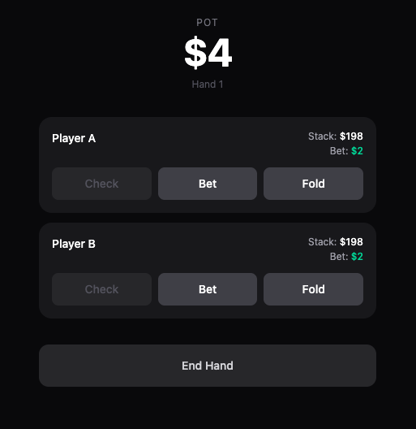
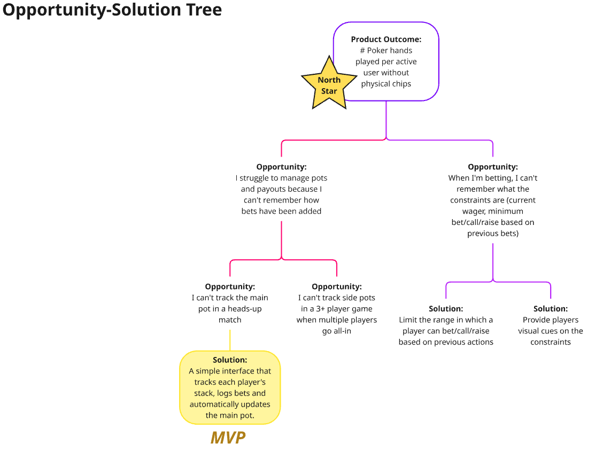
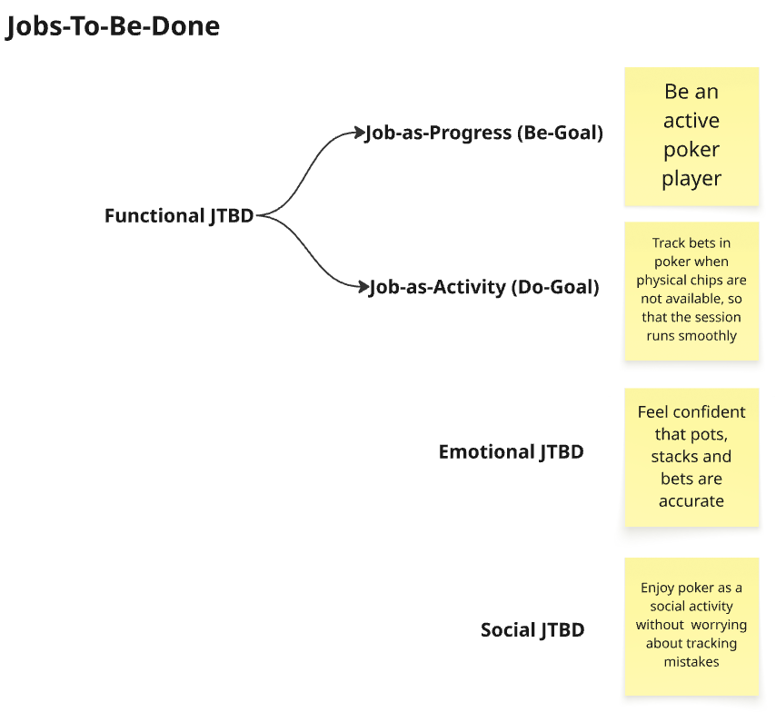
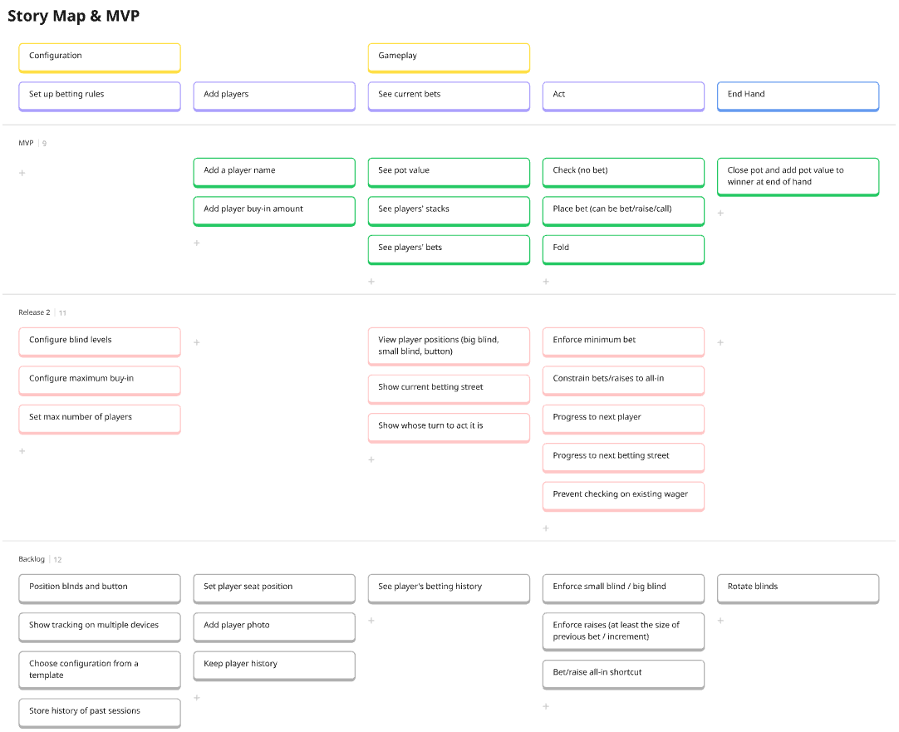
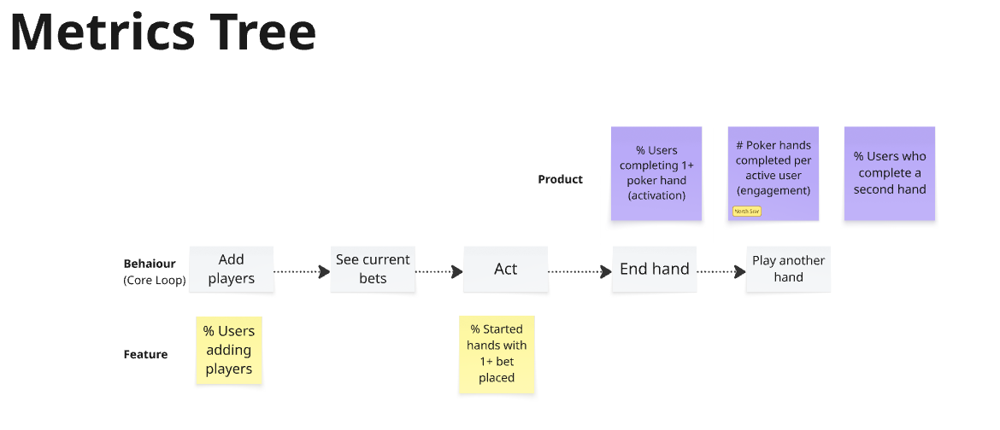
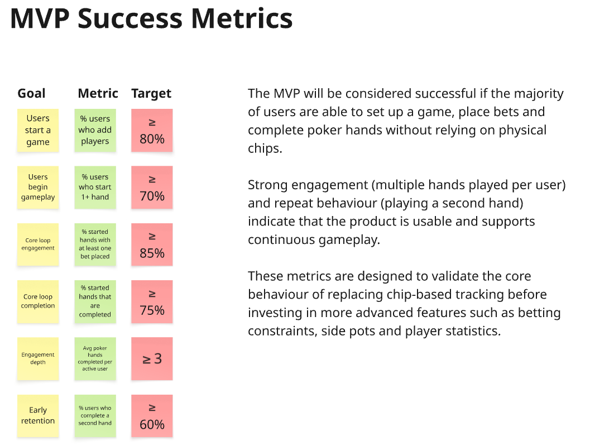

# Poker Bet Tracker

A lightweight mobile web app for tracking poker bets, stacks, and pots during casual in-person games — no physical chips required.

**→ [poker-bet-tracker.vercel.app](https://poker-bet-tracker.vercel.app/)**



---

## Product Development Process

### Discovery

| Artefact | Preview |
|---|---|
| [Opportunity-Solution Tree](docs/images/opportunity_solution_tree.png) |  |
| [Jobs-To-Be-Done](docs/images/jobs_to_be_done.png) |  |
| [Story Map & MVP Scope](docs/images/story_map.png) |  |
| [Metrics Tree](docs/images/metrics_tree.png) |  |
| [MVP Success Metrics](docs/images/success_metrics.png) |  |

### Definition

| Document | Description |
|---|---|
| [PRD](docs/prd.md) | Problem, target user, JTBD, MVP scope, functional requirements, success metrics |
| [Roadmap](docs/roadmap.md) | Release strategy — MVP, Release 2 candidates, backlog, and decision checkpoints |

### Measurement

| Artefact | Link |
|---|---|
| Analytics | [Mixpanel Dashboard](https://mixpanel.com/p/65kHTYq3rAT8VAvK5Es1Q2) |

---

## The Problem

Playing poker without chips means someone has to mentally track every player's stack, every bet placed, and the running pot. It's error-prone, slows the game down, and erodes trust that the numbers are right.

Poker Bet Tracker replaces that mental overhead with a simple, always-visible interface anyone at the table can glance at and trust.

---

## Core Loop + North Star

**Add players → See current bets → Act → End hand → Play another hand**

Every feature decision was evaluated against whether it supported this loop. If it didn't, it was cut.

**North Star Metric:** # poker hands completed per active user without physical chips

---

## Target User

Casual poker players playing informally with friends, in-person, without chips. They have a deck of cards and a phone. They are not competitive or tournament players — they want a fast, trustworthy way to keep the game moving.

---

## MVP Scope

**In scope**
- Add player names and buy-in amounts (starting stacks)
- Live pot total that updates as bets are placed
- Per-player stack and current bet always visible
- Actions: **Check**, **Bet** (covers call/raise), **Fold**
- End hand flow — select winner, award pot, reset for next hand
- Stacks carry over between hands

**Intentionally excluded**
- Blind levels and blind posting
- Turn order enforcement
- Minimum bet / raise-size rules
- Side pots and split pots
- Session history and persistence

These are Release 2 and backlog candidates, not oversights. See [roadmap.md](docs/roadmap.md).

---

## Success Metrics

| Goal | Metric | Target |
|---|---|---|
| Users start a game | % users who add players | ≥ 80% |
| Users begin gameplay | % users who start 1+ hand | ≥ 70% |
| Core loop engagement | % started hands with 1+ bet placed | ≥ 85% |
| Core loop completion | % started hands completed | ≥ 75% |
| Engagement depth | Avg hands completed per active user | ≥ 3 |
| Early retention | % users who complete a second hand | ≥ 60% |

---

## Roadmap

**MVP** — Core tracking loop (this release)

**Release 2** — Blind config, turn order, betting street progression, rules enforcement

**Backlog** — Side pots, session history, multi-device, seat positions

See [roadmap.md](docs/roadmap.md) for full detail and the conditions that unlock each release.

---

## Reflection & Key Learnings

**Upfront PM structure shaped better product decisions.**
Defining the problem, JTBD, and north star before writing any code made scope decisions easier and more defensible. When something was tempting to add — turn order, blind enforcement — the OST made it clear it was a Release 2 problem, not an MVP problem.

**The narrowest version of the core loop is the right place to start.**
The MVP deliberately avoids poker-specific complexity. The real question wasn't "can we build a poker engine?" — it was "will users trust a simple tracker enough to play multiple hands?" Scoping to that question kept the build focused.

**Simple over comprehensive is a discipline, not a default.**
Every feature cut was a deliberate choice backed by the product principles. The goal was a trustworthy, glanceable interface — not a rule-complete simulator.

> The first goal is simple, trustworthy hand tracking. Complexity is earned, not assumed.

---

## Tech Stack

| Layer | Choice |
|---|---|
| Framework | React (Vite) |
| Styling | Tailwind CSS |
| State management | React state / useReducer |
| Backend | None — client-side only |
| Analytics | Mixpanel |
| Deployment | Vercel |

---

## Local Development

### Prerequisites
- Node.js 18+
- npm or yarn

### Setup

```bash
git clone https://github.com/your-username/poker-bet-tracker.git
cd poker-bet-tracker
npm install
npm run dev
```

Open [http://localhost:5173](http://localhost:5173) in your browser.

| Command | Description |
|---|---|
| `npm run dev` | Start dev server with hot reload |
| `npm run build` | Build for production → `dist/` |
