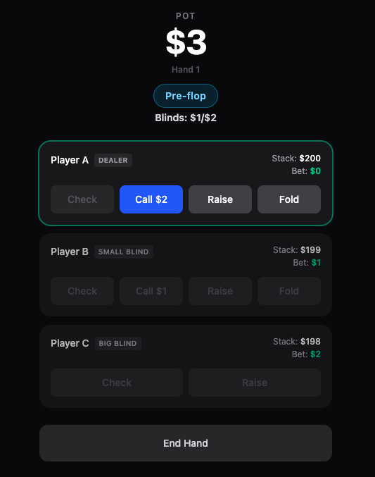

# Poker Bet Tracker

A lightweight mobile web app for tracking poker bets, stacks, and pots during casual in-person games — no physical chips required.

**→ [poker-bet-tracker.vercel.app](https://poker-bet-tracker.vercel.app/)**



⚠️ This app uses virtual units only and does not support real-money transactions or payments.

---

## Product Development Process

### Discovery

| Artefact | Preview |
|---|---|
| [Opportunity-Solution Tree](docs/images/opportunity_solution_tree.png) |  |
| [Jobs-To-Be-Done](docs/images/jobs_to_be_done.png) |  |
| [Story Map & MVP Scope](docs/images/story_map.png) |  |
| [Metrics Tree](docs/images/metrics_tree.png) |  |
| [MVP Success Metrics](docs/images/success_metrics.png) |  |

### Definition

| Document | Description |
|---|---|
| [PRD](docs/prd.md) | Problem, target user, JTBD, MVP scope, functional requirements, success metrics |
| [Roadmap](docs/roadmap.md) | Release strategy — MVP, Release 2 candidates, backlog, and decision checkpoints |

### Measurement

| Artefact | Link |
|---|---|
| Analytics | [Mixpanel Dashboard](https://mixpanel.com/p/65kHTYq3rAT8VAvK5Es1Q2) |
| User Feedback | [Feedback Form](https://docs.google.com/forms/d/e/1FAIpQLSfEjYABmkLZCA-GHMYz_qO0tPQD1e-WqhakBQ-in3KlVz4qmA/viewform) |
| Findings and Recommendations | [Full Report](docs/findings-and-recommendations.md) |

---

## The Problem

Playing poker without chips means someone has to mentally track every player's stack, every bet placed, and the running pot. It's error-prone, slows the game down, and erodes trust that the numbers are right.

Poker Bet Tracker replaces that mental overhead with a simple, always-visible interface anyone at the table can glance at and trust.

---

## Core Loop + North Star

**Add players → See current bets → Act → End hand → Play another hand**

Every feature decision was evaluated against whether it supported this loop. If it didn't, it was cut.

**North Star Metric:** # poker hands completed per active user without physical chips

---

## Target User

Casual poker players playing informally with friends, in-person, without chips. They have a deck of cards and a phone. They are not competitive or tournament players — they want a fast, trustworthy way to keep the game moving.

---

## MVP Scope

**In scope**
- Add player names and buy-in amounts (starting stacks)
- Live pot total that updates as bets are placed
- Per-player stack and current bet always visible
- Actions: **Check**, **Bet** (covers call/raise), **Fold**
- End hand flow — select winner, award pot, reset for next hand
- Stacks carry over between hands

**Intentionally excluded**
- Blind levels and blind posting
- Turn order enforcement
- Minimum bet / raise-size rules
- Side pots and split pots
- Session history and persistence

These are Release 2 and backlog candidates, not oversights. See [roadmap.md](docs/roadmap.md).

---

## Success Metrics

| Goal | Metric | Target |
|---|---|---|
| Users start a game | % users who add players | ≥ 80% |
| Users begin gameplay | % users who start 1+ hand | ≥ 70% |
| Core loop engagement | % started hands with 1+ bet placed | ≥ 85% |
| Core loop completion | % started hands completed | ≥ 75% |
| Engagement depth | Avg hands completed per active user | ≥ 3 |
| Early retention | % users who complete a second hand | ≥ 60% |

---

## Roadmap

| Release | Status | Focus |
|---|---|---|
| **MVP** | ✅ Shipped | Core loop — add players, track stacks/bets/pot, check/bet/fold, end-hand flow |
| **Release 2** | ✅ Shipped | UX polish, dealer/blind tracking, street progression, rules enforcement |
| **Backlog** | Planned | Side pots, session history, multi-device support, seat positions |

See [roadmap.md](docs/roadmap.md) for the full release strategy and the conditions that unlock each release.

---

## MVP Preview


---

## User Test Findings
**Full report:** [findings-and-recommendations.md](docs/findings-and-recommendations.md)

### MVP Metric Results

| Goal | Metric | Target | Result | Status |
|---|---|---|---|---|
| Users start a game | % users who add players | ≥ 80% | 36%* | — |
| Users begin gameplay | % users who start 1+ hand | ≥ 70% | 100% | ✅ |
| Core loop engagement | % started hands with 1+ bet placed | ≥ 85% | 100% | ✅ |
| Core loop completion | % started hands completed | ≥ 75% | 75% | ✅ |
| Engagement depth | Avg hands completed per active user | ≥ 3 | **6** | ✅ |
| Early retention | % users who complete a second hand | ≥ 60% | 100% | ✅ |

*The 36% figure is an artefact of mid-session restarts caused by bet input confusion (see below), not a setup UX problem. The funnel from player added onward converts at 100%.

### Key Findings

**The core loop works.** Users who set up a game complete hands, trust the tracked state, and come back for more. Six hands per active user — double the target — suggests the fundamental bet-tracking hypothesis is validated.

**One friction point drove most of the pain in MVP.** Users expected the bet field to match how they think about chips (**total** committed on the street). The shipped Release 2 flow uses **Raise to / Bet to** totals plus a **Minimum** line; the reducer still records **`bet_placed.bet_amount`** as the chip **increment** for funnels.

**Two features are missing and felt.** Both respondents independently raised the same two gaps: a one-touch call action (the app has everything needed to calculate this), and some way to track who is dealer, small blind, and big blind between hands.

### What Changes in the Roadmap

| Priority | Change |
|---|---|
| 🔴 Immediate | Bet input → **total street wager** UX + min validation (see PRD §5.1) |
| 🔴 Immediate | One-touch Call |
| 🟡 Pull forward | Dealer/blind tags on setup + gameplay; rotate **setup only**; auto advance on new hand |
| 🟡 Pull forward | Split pot |
| 🟢 As planned | Enforced turn order, streets + confirm modal, blind config, rules (see [bug-fixes plan](docs/implementation-plan-v2-bug-fixes.md)) |
| 🟢 As planned | All-in shortcut, side pots, history → Backlog |

---

## Release 2 (shipped)

**Full PRD:** [prd-v2.md](docs/prd-v2.md)  
**Rules enforcement detail:** [implementation-plan-v2-bug-fixes.md](docs/implementation-plan-v2-bug-fixes.md)

The post-MVP user test validated the core loop and surfaced two clear gaps: a confusing bet input and no way to track dealer/blind positions. Release 2 fixes both and adds full rules enforcement.

**UX and friction fixes**
- **Raise to / Bet to** input — enter your total street wager, not an increment; a **Minimum:** hint shows the min open or re-raise
- One-touch **Call** button, capped to all-in when the stack is short
- **Split pot** — select multiple winners in the end-hand flow; any odd chip carries forward into the next pot

**Dealer and blind tracking**
- **DEALER / SB / BB** tags on player cards during setup and gameplay
- **Rotate dealer** on the setup screen; the button auto-advances at the start of each new hand
- Blind config — set SB/BB amounts; blinds post automatically at hand start

**Rules enforcement**
- Enforced active player — only the current player can act
- **Streets** — Preflop → Flop → Turn → River, each gated by a deal-then-confirm modal before action resumes
- Min open-raise and min re-raise enforced; short all-in raises handled correctly
- Stack-capped bets — cannot bet or call more than remaining stack; all-in players skip their turn
- **Check** blocked when facing a live bet; BB-only check allowed preflop when unraised
- **Fold** only available when a call is owed
- **Busted players** (stack reaches $0 after a hand) sit out the rest of the session

---

## Tech Stack

| Layer | Choice |
|---|---|
| Framework | React (Vite) |
| Styling | Tailwind CSS |
| State management | React state / useReducer |
| Backend | None — client-side only |
| Analytics | Mixpanel (optional — set `VITE_MIXPANEL_TOKEN` from `.env.example`) |
| Deployment | Vercel |

---

## Sound effects (third-party audio)

Gameplay uses short **CC0** and **public domain** clips from `public/sounds/`.

| Use | File | License / source |
|-----|------|------------------|
| Bet, call, raise | `chip-lay-1.ogg`, `chip-lay-2.ogg` | **CC0** — *Casino Audio* by [Kenney](https://www.kenney.nl/) ([OpenGameArt bundle](https://opengameart.org/content/54-casino-sound-effects-cards-dice-chips)). Full text: [`public/sounds/KENNEY-CASINO-AUDIO-LICENSE.txt`](public/sounds/KENNEY-CASINO-AUDIO-LICENSE.txt). |
| Deal cards (street confirms) | `card-place-1.ogg` (played 3x for flop, 1x for turn/river) | Same Kenney *Casino Audio* pack (CC0), as above. |
| End-hand winner selection screen appears | `boing-cartoon-4.ogg` | **CC0 (public-domain equivalent)** — “Boing cartoon #4” by [Joseph SARDIN](https://josephsardin.fr/) from [BigSoundBank](https://bigsoundbank.com/boing-cartoon-4-s2280.html). |
| Fold | `card-place-2.ogg` | Same Kenney *Casino Audio* pack (CC0), as above. |
| Player goes all-in | `chips-handle-6.ogg` + `chips-collide-3.ogg` (layered) | Same Kenney *Casino Audio* pack (CC0), as above. |
| Pot / split-pot awarded | `chips-handle-5.ogg` | Same Kenney *Casino Audio* pack (CC0), as above. |
| Check | `door-knock-0095.ogg` | **CC0 (public-domain equivalent)** — “Door Knock” by [Joseph SARDIN](https://josephsardin.fr/) from [BigSoundBank](https://bigsoundbank.com/door-knock-s0095.html). The app plays two brief excerpts for a double-knock check cue. |

---

## Local Development

### Prerequisites
- Node.js 18+
- npm or yarn

### Setup

```bash
git clone https://github.com/your-username/poker-bet-tracker.git
cd poker-bet-tracker
npm install
npm run dev
```

Open [http://localhost:5173](http://localhost:5173) in your browser.

For analytics in local or production builds, copy `.env.example` to `.env` and set `VITE_MIXPANEL_TOKEN`.

| Command | Description |
|---|---|
| `npm run dev` | Start dev server with hot reload |
| `npm run build` | Build for production → `dist/` |
