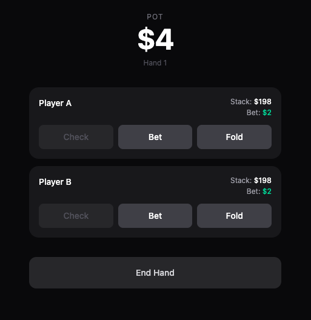
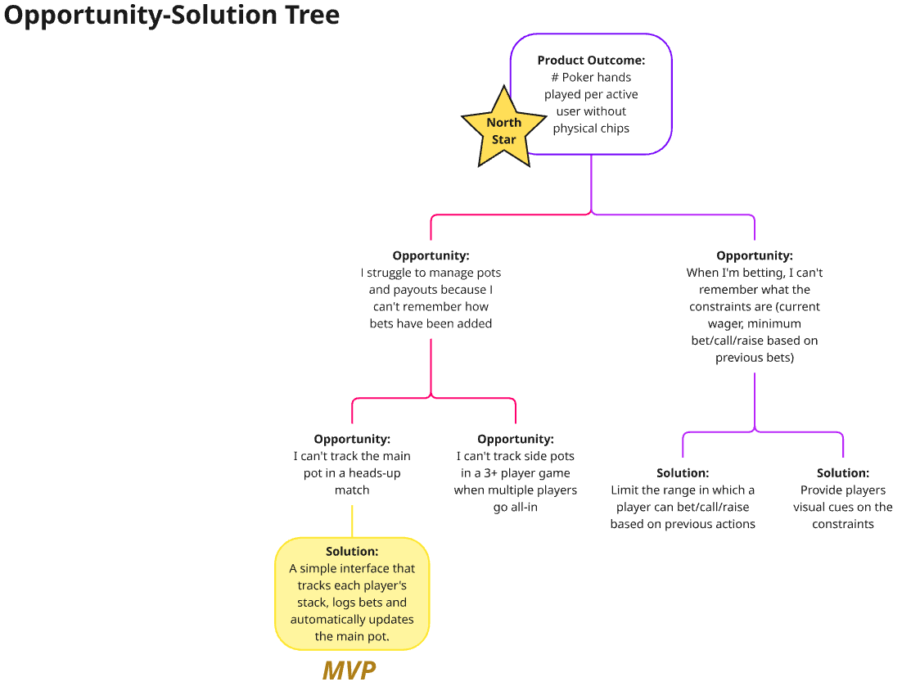
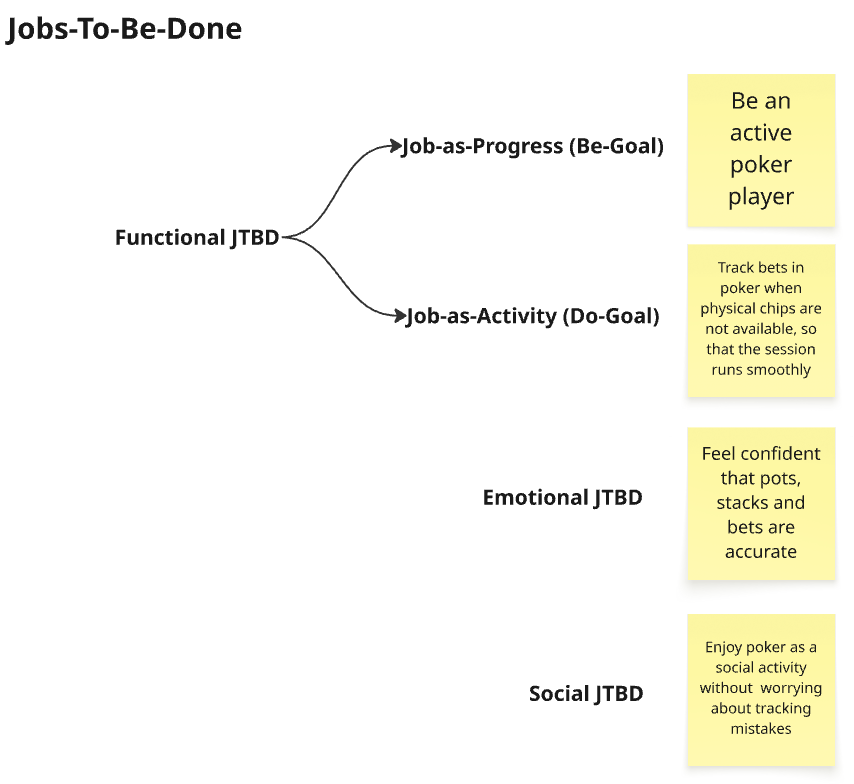
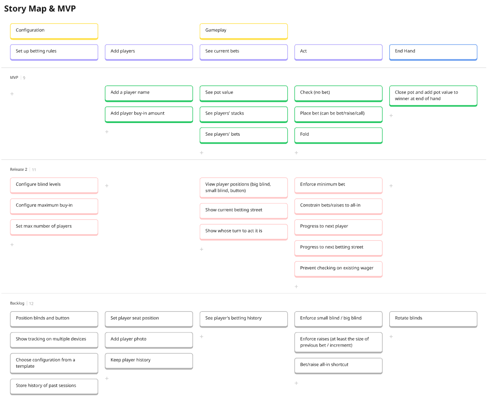
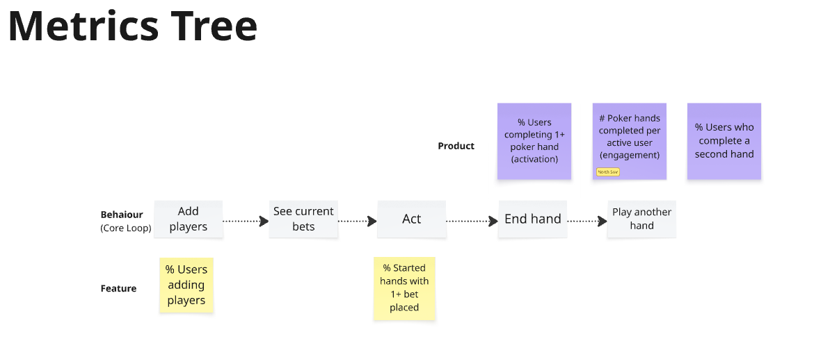
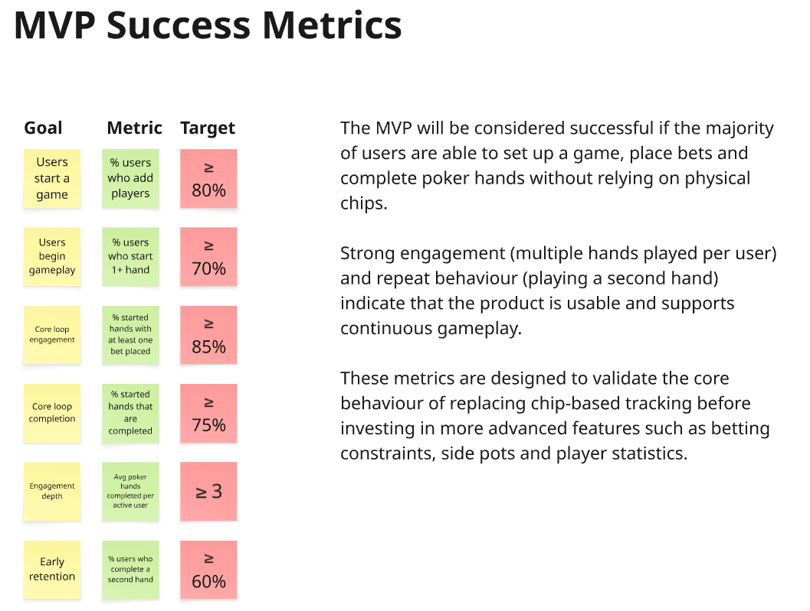
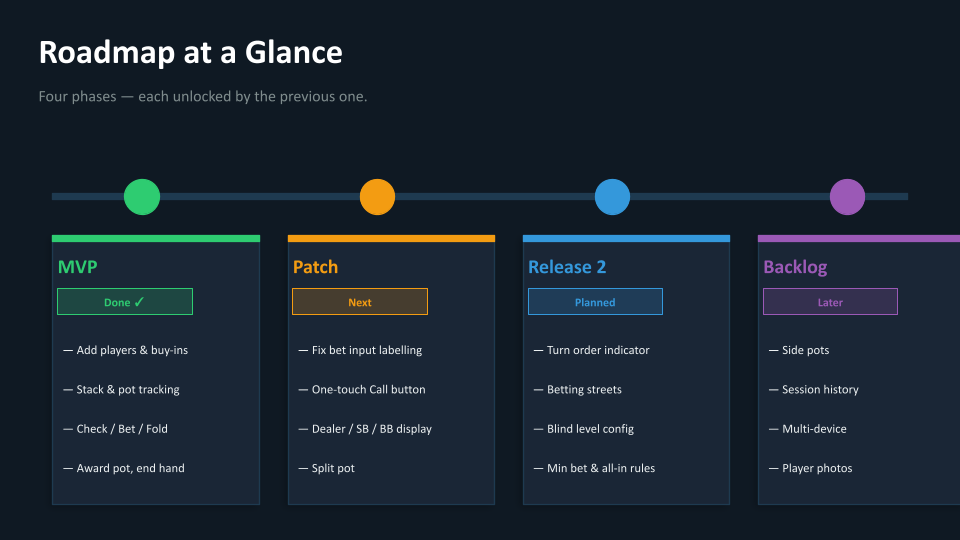

# Poker Bet Tracker

A lightweight mobile web app for tracking poker bets, stacks, and pots during casual in-person games — no physical chips required.

**→ [poker-bet-tracker.vercel.app](https://poker-bet-tracker.vercel.app/)**



⚠️ This app uses virtual units only and does not support real-money transactions or payments.

---

## Product Development Process

### Discovery

| Artefact | Preview |
|---|---|
| [Opportunity-Solution Tree](docs/images/opportunity_solution_tree.png) |  |
| [Jobs-To-Be-Done](docs/images/jobs_to_be_done.png) |  |
| [Story Map & MVP Scope](docs/images/story_map.png) |  |
| [Metrics Tree](docs/images/metrics_tree.png) |  |
| [MVP Success Metrics](docs/images/success_metrics.png) |  |

### Definition

| Document | Description |
|---|---|
| [PRD](docs/prd.md) | Problem, target user, JTBD, MVP scope, functional requirements, success metrics |
| [Roadmap](docs/roadmap.md) | Release strategy — MVP, Release 2 candidates, backlog, and decision checkpoints |

### Measurement

| Artefact | Link |
|---|---|
| Analytics | [Mixpanel Dashboard](https://mixpanel.com/p/65kHTYq3rAT8VAvK5Es1Q2) |
| User Feedback | [Feedback Form](https://docs.google.com/forms/d/e/1FAIpQLSfEjYABmkLZCA-GHMYz_qO0tPQD1e-WqhakBQ-in3KlVz4qmA/viewform) |
| Findings and Recommendations | [Full Report](docs/findings-and-recommendations.md) |

---

## The Problem

Playing poker without chips means someone has to mentally track every player's stack, every bet placed, and the running pot. It's error-prone, slows the game down, and erodes trust that the numbers are right.

Poker Bet Tracker replaces that mental overhead with a simple, always-visible interface anyone at the table can glance at and trust.

---

## Core Loop + North Star

**Add players → See current bets → Act → End hand → Play another hand**

Every feature decision was evaluated against whether it supported this loop. If it didn't, it was cut.

**North Star Metric:** # poker hands completed per active user without physical chips

---

## Target User

Casual poker players playing informally with friends, in-person, without chips. They have a deck of cards and a phone. They are not competitive or tournament players — they want a fast, trustworthy way to keep the game moving.

---

## MVP Scope

**In scope**
- Add player names and buy-in amounts (starting stacks)
- Live pot total that updates as bets are placed
- Per-player stack and current bet always visible
- Actions: **Check**, **Bet** (covers call/raise), **Fold**
- End hand flow — select winner, award pot, reset for next hand
- Stacks carry over between hands

**Intentionally excluded**
- Blind levels and blind posting
- Turn order enforcement
- Minimum bet / raise-size rules
- Side pots and split pots
- Session history and persistence

These are Release 2 and backlog candidates, not oversights. See [roadmap.md](docs/roadmap.md).

---

## Success Metrics

| Goal | Metric | Target |
|---|---|---|
| Users start a game | % users who add players | ≥ 80% |
| Users begin gameplay | % users who start 1+ hand | ≥ 70% |
| Core loop engagement | % started hands with 1+ bet placed | ≥ 85% |
| Core loop completion | % started hands completed | ≥ 75% |
| Engagement depth | Avg hands completed per active user | ≥ 3 |
| Early retention | % users who complete a second hand | ≥ 60% |

---

## Roadmap



**MVP** — Core tracking loop (this release)

**Release 2** — Blind config, turn order, betting street progression, rules enforcement, split pot

**Backlog** — Side pots, session history, multi-device, seat positions

See [roadmap.md](docs/roadmap.md) for full detail and the conditions that unlock each release.

---

## User Test Findings
**Full report:** [findings-and-recommendations.md](docs/findings-and-recommendations.md)

### MVP Metric Results

| Goal | Metric | Target | Result | Status |
|---|---|---|---|---|
| Users start a game | % users who add players | ≥ 80% | 36%* | — |
| Users begin gameplay | % users who start 1+ hand | ≥ 70% | 100% | ✅ |
| Core loop engagement | % started hands with 1+ bet placed | ≥ 85% | 100% | ✅ |
| Core loop completion | % started hands completed | ≥ 75% | 75% | ✅ |
| Engagement depth | Avg hands completed per active user | ≥ 3 | **6** | ✅ |
| Early retention | % users who complete a second hand | ≥ 60% | 100% | ✅ |

*The 36% figure is an artefact of mid-session restarts caused by bet input confusion (see below), not a setup UX problem. The funnel from player added onward converts at 100%.

### Key Findings

**The core loop works.** Users who set up a game complete hands, trust the tracked state, and come back for more. Six hands per active user — double the target — suggests the fundamental bet-tracking hypothesis is validated.

**One friction point is driving most of the pain.** Users expected the bet input to represent the total wager, not the increment to add. Entering the wrong value corrupts the pot total mid-game, which caused at least one session to be abandoned and restarted. This is the highest priority fix.

**Two features are missing and felt.** Both respondents independently raised the same two gaps: a one-touch call action (the app has everything needed to calculate this), and some way to track who is dealer, small blind, and big blind between hands.

### What Changes in the Roadmap

| Priority | Change |
|---|---|
| 🔴 Immediate | Fix bet input labelling — make clear the field adds to the current bet, not sets it |
| 🔴 Immediate | Add one-touch Call button — top friction point raised by both respondents |
| 🟡 Pull forward | Dealer/blind position display + rotate button (display only, no enforcement) |
| 🟡 Pull forward | Split pot → Release 2 (correctness gap: tied hands can't be resolved in current flow; raised by both respondents) |
| 🟢 As planned | Turn order, betting streets, blind config, rules enforcement → Release 2 |
| 🟢 As planned | All-in shortcut, side pots, history → Backlog |

---

## Release 2

**Full PRD:** [prd-v2.md](docs/prd-v2.md)

The post-MVP review validated the core loop and surfaced four things to address before the next layer of structure.

**What's being fixed first (Layer 1)**
- Bet input labelling — the additive model wasn't communicated clearly, causing users to enter the total wager instead of the increment and corrupt the pot mid-game
- One-touch Call button — both respondents raised manual call entry as friction; the app already has everything needed to calculate it
- Dealer / SB / BB position display with per-hand rotation — raised independently by both respondents as a social coordination problem, not a rules request
- Split pot — a correctness gap in the end-hand flow; tied hands currently can't be resolved within the app

**What's being added next (Layer 2)**
- Turn order and active player indicator
- Betting street display and progression (Pre-flop → Flop → Turn → River)
- Blind level configuration
- Minimum bet enforcement
- All-in stack constraints
- Check prevention when an unmatched wager exists

---

## Tech Stack

| Layer | Choice |
|---|---|
| Framework | React (Vite) |
| Styling | Tailwind CSS |
| State management | React state / useReducer |
| Backend | None — client-side only |
| Analytics | Mixpanel |
| Deployment | Vercel |

---

## Local Development

### Prerequisites
- Node.js 18+
- npm or yarn

### Setup

```bash
git clone https://github.com/your-username/poker-bet-tracker.git
cd poker-bet-tracker
npm install
npm run dev
```

Open [http://localhost:5173](http://localhost:5173) in your browser.

| Command | Description |
|---|---|
| `npm run dev` | Start dev server with hot reload |
| `npm run build` | Build for production → `dist/` |
